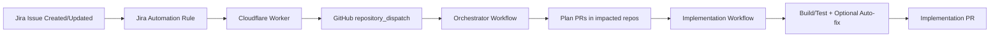

# Agentic SDLC Demo (Jira Automation + Cloudflare + GitHub)

This repository contains architecture, process, and operational assets for an **Agentic SDLC** prototype that connects **Jira Automation** to **GitHub orchestration workflows** through a **Cloudflare Worker bridge**.

---

## What This Demo Implements

- Jira issue events trigger automation flows
- Jira Automation sends HTTP requests to a Cloudflare Worker
- Worker validates/authenticates and dispatches a GitHub event
- GitHub orchestrator creates implementation plan PRs across impacted repositories
- Repository workflows implement changes, run CI, and open implementation PRs
- End-to-end traceability from Jira issue → Plan PR → Implementation PR

---

## Repository Contents

### Core architecture and flow
- `agentic-sdlc-jira-cloudfare-overview.md`  
  Primary end-to-end architecture and integration guide (with diagrams, troubleshooting, and configuration details).

- `WORKFLOW_CONTRACTS.md`  
  Event and workflow contracts across Jira Automation, Worker, orchestrator, and implementation workflows.

### Operational and governance docs
- `JIRA_WEBHOOK_SETUP.md`  
  Jira **Automation** setup guide (Send web request, headers, payload, validation).

- `OPERATIONS_RUNBOOK.md`  
  Incident response and operational troubleshooting playbook.

- `SECURITY_MODEL.md`  
  Security design, secret handling, auth model, and least-privilege recommendations.

- `WORKFLOW_CONTRACTS.md`  
  Contracts reference copy under `/docs` for documentation navigation consistency.

---

## Target Repositories in Scope

- `vinipx/service-alpha`
- `vinipx/service-beta`
- `vinipx/common-library`

---

## Quick Start (New Users)

1. Read **`agentic-sdlc-jira-cloudfare-overview.md`** for the full architecture.
2. Configure Jira sender using **`docs/JIRA_WEBHOOK_SETUP.md`** (Automation-based).
3. Validate contracts in **`WORKFLOW_CONTRACTS.md`**.
4. Run smoke test and troubleshooting from **`docs/OPERATIONS_RUNBOOK.md`**.
5. Review security requirements in **`docs/SECURITY_MODEL.md`**.

---

## End-to-End Flow (Simplified)

---

## Design Principles

- **Governed automation** (not uncontrolled generation)
- **Cross-repo consistency**
- **Test-first quality posture**
- **Code-owner enforced approvals**
- **Jira-to-code traceability**
- **Security by default** (header validation + least privilege + app-based auth)

---

## Current Integration Decision

For this demo, **Jira Automation** is the recommended sender mechanism (instead of Jira System Webhooks), because it provides:
- explicit header configuration (`x-bridge-token`)
- better audit visibility
- easier rule-level filtering and control

---

## Audience

- Solution Architects
- Engineering Managers
- Platform Teams
- Client Stakeholders evaluating AI-enabled SDLC modernization
