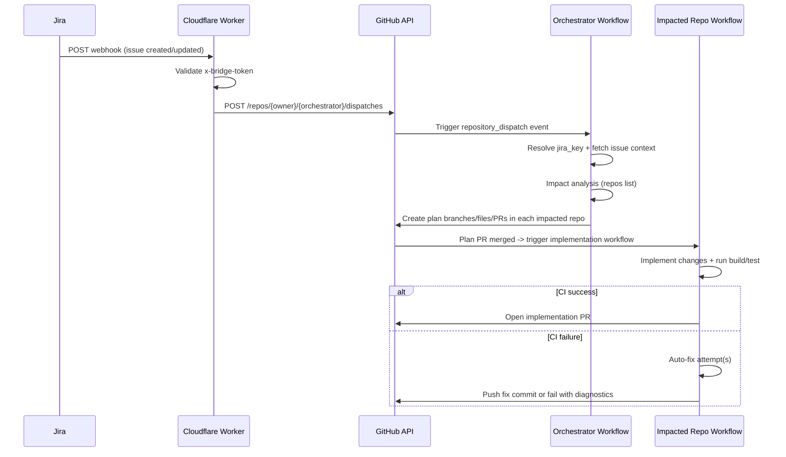

# Agentic SDLC with Jira + GitHub + Cloudflare Workers

## 1) Overview

This document explains the end-to-end **Agentic SDLC** implementation that connects Jira issue events to automated planning and implementation flows in GitHub repositories.

### Goals

- Trigger software delivery workflows from Jira issue lifecycle events.
- Generate implementation plans automatically.
- Fan out plans to impacted repositories.
- Execute implementation workflows per repository.
- Enforce build/test validation and optional auto-fix behavior.
- Preserve traceability between Jira issues and GitHub PRs.

---

## 2) High-Level Architecture

```mermaid
flowchart LR
  A[Jira Cloud<br/>Issue Created/Updated] --> B[Jira Webhook]
  B --> C[Cloudflare Worker<br/>jira-github-bridge]
  C --> D[GitHub repository_dispatch<br/>Orchestrator Repo]

  D --> E[Orchestrator Workflow<br/>jira-webhook-orchestrator.yml]
  E --> F[Impact Analysis]
  F --> G[Generate Plan Markdown per Repo]
  G --> H[Create Plan PRs in Impacted Repos]

  H --> I[Merged Plan in Repo]
  I --> J[Repo Implementation Workflow<br/>agentic-implementation.yml]
  J --> K[Code changes + Build/Test]
  K --> L{CI Green?}
  L -- Yes --> M[Open Implementation PR]
  L -- No --> N[Auto-fix loop / fail with diagnostics]
```



---

## 3) Components and Responsibilities

### 3.1 Jira Cloud

- Source of truth for business work items (Story/Task/Bug).
- Emits webhook events (Issue Created, Issue Updated).
- Can be filtered via JQL (example: `labels = agentic-sdlc`).

### 3.2 Cloudflare Worker (`jira-github-bridge`)

- Public HTTPS endpoint for Jira webhooks.
- Validates shared secret header (`x-bridge-token`).
- Extracts Jira key from payload.
- Triggers GitHub `repository_dispatch` in orchestrator repository.

Typical env vars:
- `BRIDGE_TOKEN` (secret)
- `GH_TOKEN` (secret; GitHub token)
- `GH_OWNER` (e.g., `vinipx`)
- `GH_ORCHESTRATOR_REPO` (e.g., `service-alpha` if orchestrator is there)

### 3.3 Orchestrator Workflow

- Listens to `repository_dispatch` event (type: `jira_issue_event`).
- Fetches Jira issue details.
- Performs impact analysis to determine affected repositories.
- Generates per-repo plan docs.
- Creates PRs in impacted repos with plan files.

### 3.4 Repository Implementation Workflow

- Triggered when plan file is merged into `main`.
- Creates implementation branch.
- Applies implementation changes.
- Runs `mvn clean verify` (or repo-specific build/test).
- Optional auto-fix logic on CI failures.
- Opens implementation PR.

### 3.5 GitHub App (`agentic-ci-fixer`) [Recommended]

- Replaces PAT for safer automation.
- Fine-grained, installable permissions across repos.
- Used to push commits / open PRs in automation flows.

---

## 4) End-to-End Sequence



---

## 5) Core Workflow Files

> Adjust file names to match your actual repository layout.

- **Orchestrator**
  - `.github/workflows/jira-webhook-orchestrator.yml`
- **Implementation (per repo)**
  - `.github/workflows/agentic-implementation.yml`

---

## 6) Cloudflare Worker Definition (Bridge)

Example behavior:

1. Accepts `POST` only.
2. Validates `x-bridge-token`.
3. Parses JSON and extracts Jira key from:
   - `body.issue.key` OR
   - `body.data.issue.key` OR
   - `body.key`
4. Calls GitHub repository dispatch:
   - `event_type: jira_issue_event`
   - `client_payload: { jira_key: "AISDLC-2" }`

---

## 7) Security Model

### 7.1 Worker Security

- Shared secret header (`x-bridge-token`) from Jira to Worker.
- Worker secrets managed in Cloudflare Variables/Secrets.
- Do not expose tokens in logs or responses.

### 7.2 GitHub Security

- Prefer GitHub App over PAT for automation.
- Minimum required permissions:
  - Contents: Read/Write
  - Pull requests: Read/Write
  - Metadata: Read
- Install app only on required repositories.

### 7.3 Jira Security

- Use webhook scope filters (JQL) to reduce noise.
- Restrict events to required transitions (created/updated).

---

## 8) Failure Modes and Troubleshooting

### 8.1 Worker returns `Method Not Allowed`
- Expected for browser GET.
- Worker is POST-only.
- Test with `curl -X POST`.

### 8.2 Worker returns `401 Unauthorized`
- `x-bridge-token` missing or mismatched against `BRIDGE_TOKEN`.

### 8.3 Worker returns `502 GitHub dispatch failed: 404`
- Wrong `GH_OWNER` / `GH_ORCHESTRATOR_REPO`.
- Token lacks access to target repo.
- Wrong endpoint or private repo visibility mismatch.

### 8.4 GitHub workflow `403 Resource not accessible by personal access token`
- Token lacks `pull_requests:write` or repo access.
- Replace with GitHub App installation token.

### 8.5 Compilation failure in implementation PR
- Auto-fix step may be placeholder (no actual patch logic).
- Add deterministic fixers or LLM fixer integration.
- Ensure retry loop modifies code between retries.

---

## 9) Recommended Workflow Ordering (Implementation)

In `agentic-implementation.yml`, use this order:

1. Resolve context (jira key, plan file)
2. Validate plan exists
3. Idempotency guard (skip if done marker exists)
4. Parse plan metadata
5. Create impl branch
6. Apply implementation changes
7. **Build/Test**
8. **Auto-fix loop if build failed**
9. Enforce non-empty implementation diff
10. Mark plan as done
11. Commit/push
12. Open PR

---

## 10) Use Cases

### 10.1 Standard Feature Delivery
- Jira Story created (`AISDLC-123`).
- Plan PRs created in 2 impacted repos.
- Plans merged.
- Implementation PRs generated with validated CI.

### 10.2 Cross-Repo Change
- Shared DTO change in `common-library`.
- Downstream implementation plans in services.
- Coordinated PR creation and build validation.

### 10.3 Regression Recovery
- CI fails due to known compile pattern.
- Auto-fix rule applies safe patch.
- Build re-run passes, PR remains green.

### 10.4 Manual Replay / Backfill
- Use `workflow_dispatch` with `jira_key` for rerun.
- Useful when webhook was missed or config changed.

---

## 11) Operational Runbook

### 11.1 Smoke Test Bridge

```bash
curl -i -X POST "https://jira-github-bridge.<subdomain>.workers.dev/" \
  -H "content-type: application/json" \
  -H "x-bridge-token: <BRIDGE_TOKEN>" \
  -d '{"issue":{"key":"AISDLC-2"}}'
```

Expected:
- `200 Dispatched AISDLC-2`

### 11.2 Verify Dispatch

- Check orchestrator workflow run at trigger time.
- Confirm `repository_dispatch` event payload has Jira key.

### 11.3 Verify Fan-Out

- Confirm plan PR exists for each impacted repo.

### 11.4 Verify Implementation

- Confirm implementation workflow triggered on merged plan.
- Confirm CI pass/fail handling behavior.

---

## 12) Governance and Best Practices

- Keep bridge logic minimal and deterministic.
- Keep orchestration idempotent.
- Use explicit branch naming conventions:
  - `agentic-plan/<jira>-<run_id>`
  - `agentic-impl/<jira>-<run_id>`
- Add done markers to prevent duplicate processing.
- Enforce CI gates before opening/merging implementation PRs.
- Track all links: Jira issue ↔ Plan PR ↔ Implementation PR.

---

## 13) Roadmap Enhancements

- Add retry + dead-letter queue for failed dispatches.
- Add structured logging + centralized observability.
- Add policy checks (security scan, license scan, SAST).
- Add approval gates for high-risk Jira labels.
- Add richer impact analysis using code ownership/dependency graph.
- Add comment bot that posts run status to Jira issue.

---

## 14) Glossary

- **Bridge**: Cloudflare Worker receiving Jira webhook and dispatching GitHub event.
- **Orchestrator**: Workflow that converts Jira event into plan PRs.
- **Plan PR**: PR adding implementation plan markdown to impacted repo.
- **Implementation PR**: PR with actual code changes from merged plan.
- **Done Marker**: file indicating plan already processed.

---

## 15) Current Known Decisions

- Cloudflare Worker is used as public webhook bridge.
- GitHub App is preferred over PAT for automation.
- Implementation workflow includes Build/Test before plan completion.
- Auto-fix is allowed but should be bounded and auditable.

---

## 16) Example Repository Topology

- `vinipx/common-library`
- `vinipx/service-alpha` (can host orchestrator)
- `vinipx/service-beta`

---

## 17) Ownership

- Platform/DevEx owns orchestration pipelines and app credentials.
- Service teams own implementation workflow behavior in each repo.
- Product/Engineering owns Jira workflow and issue hygiene.

---

## 18) Detailed Configuration Guide (What, Where, Why)

This section explains exactly where each integration is configured and why each setting exists.

### 18.1 Jira Webhook Configuration (Sender)

**Where configured:** Jira Cloud (Admin)  
- Jira Settings → System → Webhooks (or Jira Automation with “Send web request”)

**What to configure:**
- **URL**: Cloudflare Worker endpoint  
  `https://jira-github-bridge.<subdomain>.workers.dev/`
- **Method**: `POST`
- **Events**: Issue created / Issue updated (as needed)
- **Optional JQL filter**:  
  Example: `project = AISDLC AND labels = agentic-sdlc`
- **Custom header**:
  - `x-bridge-token: <YOUR_SHARED_SECRET>`

**Why this matters:**
- Jira is the **event source**.
- Header authenticates Jira as trusted caller.
- JQL avoids triggering pipeline for unrelated issues.

> Important: creating a Jira issue manually in the UI does **not** require manually adding headers.  
> Jira itself sends the webhook and includes configured custom headers automatically.

---

### 18.2 Cloudflare Worker Configuration (Bridge/Adapter)

**Where configured:** Cloudflare Workers dashboard (or `wrangler` config)

**Required Worker secrets/vars:**
- `BRIDGE_TOKEN` → must match Jira `x-bridge-token`
- `GH_TOKEN` (or GitHub App token flow) → used to call GitHub API
- `GH_OWNER` → e.g. `vinipx`
- `GH_ORCHESTRATOR_REPO` → repo receiving `repository_dispatch`

**Worker responsibilities:**
1. Accept POST webhook from Jira
2. Verify `x-bridge-token`
3. Extract Jira key from payload
4. Trigger GitHub `repository_dispatch` event

**Why Worker exists (instead of Jira calling GitHub directly):**
- Security isolation (hide GitHub auth from Jira)
- Payload normalization (Jira payload variants → stable `jira_key`)
- Centralized control (logging, retries, filtering, rate limiting)

---

### 18.3 GitHub Orchestrator Configuration

**Where configured:** Orchestrator repository workflow  
- File: `.github/workflows/jira-webhook-orchestrator.yml`

**Must include trigger:**
- `on: repository_dispatch` with type `jira_issue_event`

**Expected dispatch payload:**
- `client_payload.jira_key` (e.g. `AISDLC-2`)

**Why this is needed:**
- Decouples external webhook from internal planning logic.
- Converts Jira issue context into plan PRs across impacted repos.

---

### 18.4 GitHub App Configuration (Recommended over PAT)

**Where configured:** GitHub → Settings → Developer settings → GitHub Apps

**Create one app for all repos** (recommended):
- Install on:
  - `vinipx/service-alpha`
  - `vinipx/service-beta`
  - `vinipx/common-library`

**Minimum repository permissions:**
- Contents: Read & Write
- Pull requests: Read & Write
- Metadata: Read

**Store in Actions secrets:**
- `GH_APP_ID`
- `GH_APP_PRIVATE_KEY`
- `GH_APP_INSTALLATION_ID` (if needed by your token flow)

**Why GitHub App over PAT:**
- Better security model and auditable permissions
- Easier rotation and scoping
- Cleaner cross-repo automation at scale

---

### 18.5 Repo Implementation Workflow Configuration

**Where configured:** Each impacted repo  
- File: `.github/workflows/agentic-implementation.yml`

**Recommended trigger:**
- `push` to `main` for `docs/implementation-plans/*-plan.md`
- optional `workflow_dispatch` for rerun/backfill

**Recommended sequence:**
1. Resolve plan context
2. Guard idempotency (`*-done.md`)
3. Create impl branch
4. Apply code changes
5. Build/Test
6. Auto-fix (if enabled and configured)
7. Commit/push
8. Open implementation PR

**Why this order:**
- Prevents “done” marker before validating code.
- Ensures PR quality and traceability.

---

### 18.6 Header/Auth Reasoning Deep Dive

#### Why `x-bridge-token`?
Worker URL is public internet endpoint.  
Without token validation, anyone could trigger your pipeline by posting fake issue payloads.

#### Is the header added when ticket is manually created in Jira?
Yes—indirectly.  
Manual issue creation triggers Jira event → Jira webhook sender includes configured headers.

#### Why still test with `curl` manually?
To validate Worker independently of Jira UI/events and isolate problems quickly.

---

### 18.7 Validation Checklist (End-to-End)

1. **Jira webhook delivery logs** show 2xx to Worker.
2. Worker returns `200 Dispatched <JIRA_KEY>`.
3. Orchestrator workflow run appears with matching timestamp.
4. Plan PRs created in all impacted repos.
5. Implementation workflows trigger after plan merge.
6. CI passes OR auto-fix attempts are visible and deterministic.
7. Implementation PRs contain Jira references.

---

### 18.8 Common Misconfigurations and Exact Fixes

- **401 from Worker**
  - Fix: Jira header token does not match `BRIDGE_TOKEN`.
- **502 + GitHub 404 from Worker**
  - Fix: verify `GH_OWNER`, `GH_ORCHESTRATOR_REPO`, and token repo access.
- **403 in GitHub Actions (“Resource not accessible by personal access token”)**
  - Fix: move to GitHub App token or expand PAT scopes + repo access.
- **Auto-fix loop not fixing anything**
  - Fix: replace placeholder TODO with real code-modifying logic before retry.

---

### 18.9 Suggested Documentation Matrix

Maintain these docs together:
- `agentic-sdlc-jira-cloudfare-overview.md` (architecture + integration)
- `docs/OPERATIONS_RUNBOOK.md` (incident and recovery)
- `docs/SECURITY_MODEL.md` (tokens, scopes, rotation policy)
- `docs/WORKFLOW_CONTRACTS.md` (event payload schemas and branch/file conventions)

This prevents tribal knowledge and speeds onboarding.
