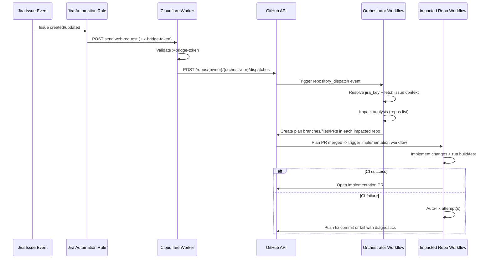

# Agentic SDLC with Jira Automation + GitHub + Cloudflare Workers

## 1) Overview

This document explains the end-to-end **Agentic SDLC** implementation that connects **Jira Automation issue events** to automated planning and implementation flows in GitHub repositories.

### Goals

- Trigger software delivery workflows from Jira issue lifecycle events.
- Generate implementation plans automatically.
- Fan out plans to impacted repositories.
- Execute implementation workflows per repository.
- Enforce build/test validation and optional auto-fix behavior.
- Preserve traceability between Jira issues and GitHub PRs.

---

## 2) High-Level Architecture

```mermaid
flowchart LR
  A[Jira Cloud<br/>Issue Created/Updated] --> B[Jira Automation Rule<br/>Send web request]
  B --> C[Cloudflare Worker<br/>jira-github-bridge]
  C --> D[GitHub repository_dispatch<br/>Orchestrator Repo]

  D --> E[Orchestrator Workflow<br/>jira-webhook-orchestrator.yml]
  E --> F[Impact Analysis]
  F --> G[Generate Plan Markdown per Repo]
  G --> H[Create Plan PRs in Impacted Repos]

  H --> I[Merged Plan in Repo]
  I --> J[Repo Implementation Workflow<br/>agentic-implementation.yml]
  J --> K[Code changes + Build/Test]
  K --> L{CI Green?}
  L -- Yes --> M[Open Implementation PR]
  L -- No --> N[Auto-fix loop / fail with diagnostics]
```



---

## 3) Components and Responsibilities

### 3.1 Jira Cloud + Automation

- Source of truth for business work items (Story/Task/Bug).
- Jira **Automation Rule** emits HTTP requests on Issue Created / Updated.
- Can be filtered via JQL (example: `project = AISDLC AND labels = agentic-sdlc`).
- Adds required headers (including `x-bridge-token`) in the Send web request action.

### 3.2 Cloudflare Worker (`jira-github-bridge`)

- Public HTTPS endpoint for Jira Automation requests.
- Validates shared secret header (`x-bridge-token`).
- Extracts Jira key from payload.
- Triggers GitHub `repository_dispatch` in orchestrator repository.

Typical env vars:
- `BRIDGE_TOKEN` (secret)
- `GH_TOKEN` (secret; GitHub token) or GitHub App flow
- `GH_OWNER` (e.g., `vinipx`)
- `GH_ORCHESTRATOR_REPO` (e.g., `service-alpha` if orchestrator is there)

### 3.3 Orchestrator Workflow

- Listens to `repository_dispatch` event (type: `jira_issue_event`).
- Fetches Jira issue details.
- Performs impact analysis to determine affected repositories.
- Generates per-repo plan docs.
- Creates PRs in impacted repos with plan files.

### 3.4 Repository Implementation Workflow

- Triggered when plan file is merged into `main`.
- Creates implementation branch.
- Applies implementation changes.
- Runs `mvn clean verify` (or repo-specific build/test).
- Optional auto-fix logic on CI failures.
- Opens implementation PR.

### 3.5 GitHub App (`agentic-ci-fixer`) [Recommended]

- Replaces PAT for safer automation.
- Fine-grained, installable permissions across repos.
- Used to push commits / open PRs in automation flows.

---

## 4) End-to-End Sequence



---

## 5) Core Workflow Files

- **Orchestrator**
  - `.github/workflows/jira-webhook-orchestrator.yml`
- **Implementation (per repo)**
  - `.github/workflows/agentic-implementation.yml`

---

## 6) Jira Automation Definition (Sender)

Expected behavior:

1. Trigger on Issue Created (and optionally Issue Updated).
2. Optional condition/JQL filter for project/label scope.
3. Send web request:
   - URL: Worker endpoint
   - Method: POST
   - Headers:
     - `Content-Type: application/json`
     - `x-bridge-token: <shared-secret>`
   - Body includes Jira key (e.g. `{"issue":{"key":"{{issue.key}}"}}`)

---

## 7) Security Model

### 7.1 Worker Security

- Shared secret header (`x-bridge-token`) from Jira Automation to Worker.
- Worker secrets managed in Cloudflare Variables/Secrets.
- Do not expose tokens in logs or responses.

### 7.2 GitHub Security

- Prefer GitHub App over PAT for automation.
- Minimum required permissions:
  - Contents: Read/Write
  - Pull requests: Read/Write
  - Metadata: Read
- Install app only on required repositories.

### 7.3 Jira Security

- Use Automation conditions/JQL to reduce noise.
- Restrict triggers to required events (created/updated).

---

## 8) Failure Modes and Troubleshooting

### 8.1 Worker returns `Method Not Allowed`
- Expected for browser GET.
- Worker is POST-only.
- Test with `curl -X POST`.

### 8.2 Worker returns `401 Unauthorized`
- `x-bridge-token` missing or mismatched against `BRIDGE_TOKEN`.
- Verify Jira Automation Send web request headers.

### 8.3 Worker returns `502 GitHub dispatch failed: 404`
- Wrong `GH_OWNER` / `GH_ORCHESTRATOR_REPO`.
- Token lacks access to target repo.
- Wrong endpoint or private repo visibility mismatch.

### 8.4 GitHub workflow `403 Resource not accessible by personal access token`
- Token lacks `pull_requests:write` or repo access.
- Replace with GitHub App installation token.

### 8.5 Compilation failure in implementation PR
- Auto-fix step may be placeholder (no actual patch logic).
- Add deterministic fixers or LLM fixer integration.
- Ensure retry loop modifies code between retries.

---

## 9) Recommended Workflow Ordering (Implementation)

In `agentic-implementation.yml`, use this order:

1. Resolve context (jira key, plan file)
2. Validate plan exists
3. Idempotency guard (skip if done marker exists)
4. Parse plan metadata
5. Create impl branch
6. Apply implementation changes
7. **Build/Test**
8. **Auto-fix loop if build failed**
9. Enforce non-empty implementation diff
10. Mark plan as done
11. Commit/push
12. Open PR

---

## 10) Use Cases

### 10.1 Standard Feature Delivery
- Jira issue created (`AISDLC-123`) with `agentic-sdlc` label.
- Automation rule sends request to Worker.
- Plan PRs created in impacted repos.
- Plans merged.
- Implementation PRs generated with validated CI.

### 10.2 Cross-Repo Change
- Shared DTO change in `common-library`.
- Downstream implementation plans in services.
- Coordinated PR creation and build validation.

### 10.3 Regression Recovery
- CI fails due to known compile pattern.
- Auto-fix rule applies safe patch.
- Build re-run passes, PR remains green.

### 10.4 Manual Replay / Backfill
- Use `workflow_dispatch` with `jira_key` for rerun.
- Useful when automation was misconfigured or temporarily disabled.

---

## 11) Operational Runbook

### 11.1 Smoke Test Bridge

```bash
curl -i -X POST "https://jira-github-bridge.<subdomain>.workers.dev/" \
  -H "content-type: application/json" \
  -H "x-bridge-token: <BRIDGE_TOKEN>" \
  -d '{"issue":{"key":"AISDLC-2"}}'
```

Expected:
- `200 Dispatched AISDLC-2`

### 11.2 Verify Jira Automation Delivery

- Check Jira Automation rule **Audit Log** for issue key and HTTP response.
- Confirm Send web request action succeeded (2xx).

### 11.3 Verify Dispatch

- Check orchestrator workflow run at trigger time.
- Confirm `repository_dispatch` event payload has Jira key.

### 11.4 Verify Fan-Out

- Confirm plan PR exists for each impacted repo.

### 11.5 Verify Implementation

- Confirm implementation workflow triggered on merged plan.
- Confirm CI pass/fail handling behavior.

---

## 12) Governance and Best Practices

- Keep bridge logic minimal and deterministic.
- Keep orchestration idempotent.
- Use explicit branch naming conventions:
  - `agentic-plan/<jira>-<run_id>`
  - `agentic-impl/<jira>-<run_id>`
- Add done markers to prevent duplicate processing.
- Enforce CI gates before opening/merging implementation PRs.
- Track all links: Jira issue ↔ Plan PR ↔ Implementation PR.

---

## 13) Roadmap Enhancements

- Add retry + dead-letter queue for failed dispatches.
- Add structured logging + centralized observability.
- Add policy checks (security scan, license scan, SAST).
- Add approval gates for high-risk Jira labels.
- Add richer impact analysis using code ownership/dependency graph.
- Add comment bot that posts run status to Jira issue.

---

## 14) Glossary

- **Bridge**: Cloudflare Worker receiving Jira Automation requests and dispatching GitHub event.
- **Orchestrator**: Workflow that converts Jira event into plan PRs.
- **Plan PR**: PR adding implementation plan markdown to impacted repo.
- **Implementation PR**: PR with actual code changes from merged plan.
- **Done Marker**: file indicating plan already processed.

---

## 15) Current Known Decisions

- Jira **Automation** is the sender mechanism (preferred over Jira system webhook for this setup).
- Cloudflare Worker is used as public bridge.
- GitHub App is preferred over PAT for automation.
- Implementation workflow includes Build/Test before plan completion.
- Auto-fix is allowed but should be bounded and auditable.
